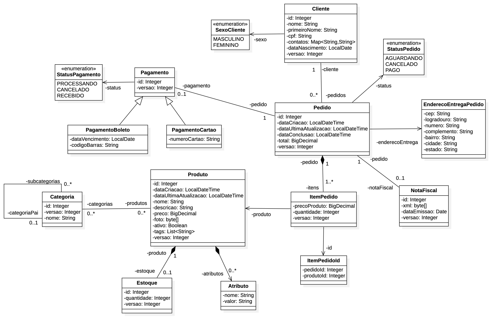

# AlgaWorks - Curso Especialista JPA

Curso com foco no mapeamento e desenvolvimento da persistência de dados com JPA.

## :receipt:Sumário

1. [Introdução](#intro)
2. [Iniciando com JPA](#iniciando)
3. [Mapeamento Básico](#basico)

## :clipboard:Introdução 

### O que é persistência de dados?

> É armazenar informação pelo período de tempo desejado de forma que ela possa ser recuperada ou apagada.

### O que é JPA?

> Java Persistence API é uma API padrão da linguagem Java que descreve uma interface comum para frameworks de persistência de dados. A JPA define um meio de mapeamento objeto-relacional para objetos Java simples e comuns, denominados beans de entidade.

### O que é Mapeamento Objeto-Relacional (ORM)?

> Object-Relational Mapping (ORM) é uma técnica para aproximar(traduzir) o paradigma de desenvolvimento de aplicações orientadas a objetos ao paradigma do banco de dados relacional.

### Versões utilizadas

- Java JDK 17
- MySQL 8
- Hibernate 6
- JUnit 5
- IntelliJ IDEA 2023.1

## :man_technologist: Iniciando com JPA 

### Dependências(Maven 3.8.1) adicionadas

- Lombok 1.18.30 - biblioteca Java focada em produtividade e redução de código boilerplate
- Hibernate 6.2.2 -  framework ORM(mapeamento objeto-relacional)
- MySQL 8.0.33 - conector do banco de dados
- Junit 5.9.3 - framework com suporte de testes unitários

### Classes adicionadas

- src/main/java/com/nunesd66/ecommerce/model/
  - Cliente (nome)
  - Produto (nome, descricao, preco)

### Arquivos de execução adicionados
  - IniciarUnidadeDePersistencia - testa se a aplicação roda corretamente

### Arquivos de configuração adicionados

- src/main/resouces/META-INF/
  - persistence.xml - arquivo de configuração do banco de dados

- src/main/resouces/META-INF/banco-de-dados/
  - dados-iniciais.sql - registros adicionados para testes

### Arquivos de testes adicionados

- src/test/java/com/nunesd66/ecommerce/
  - EntityManagerTest - classe genérica de testes

- src/test/java/com/nunesd66/ecommerce/iniciandocomjpa/
  - ConsultandoRegistrosTest - primeiro exemplo de testes
  - OperacoesComTransacaoTest - exemplos de testes um pouco mais abrangentes
  - PrimeiroCrudTest - exercício de testes
  
## :world_map: Mapeamento Básico 

### Módelo de domínio

### Classea alteradas
- src/main/java/com/nunesd66/ecommerce/model/
  - Cliente (nome, sexo)

### Classes adicionadas

- src/main/java/com/nunesd66/ecommerce/model/
  - Categoria (nome, categoriaPaiId)
  - EnderecoEntregaPedido (cep, logradouro, numero, complemento, bairro, cidade, estado)
  - Estoque (produtoId, quantidade)
  - ItemPedido (pedidoId, produtoId, precoProduto, quantidade)
  - NotaFiscal (pedidoId, xml, dataEmissao)
  - PagamentoBoleto (pedidoId, status, codigoBarras)
  - PagamentoCartao (pedidoId, status, numero)
  - Pedido (dataPedido, dataConclusao, notaFiscalId, total, status, enderecoEntrega)

### Arquivos de testes adicionados

- src/test/java/com/nunesd66/ecommerce/mapeamentobasico/
  - EstrategiaChavePrimariaTest - testar diferentes tipos de @GeneratedValue
  - MapeamentoObjetoEmbutidoTest - testar objeto embutido por Pedido.EnderecoEntregaPedido
  - MapeandoEnumeracoesTest - testar salvamentos de @Enumerated no banco de dados
