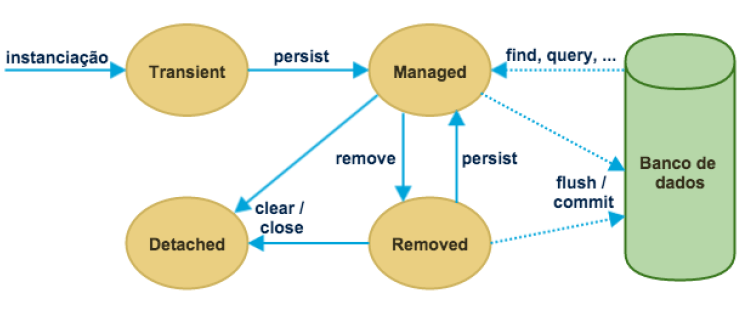

# AlgaWorks - Curso Especialista JPA

> Curso com foco no mapeamento e desenvolvimento da persistência de dados com JPA. 

> Repositório de referência de estudos.

&nbsp;

## :receipt: Sumário

0. [Requisitos](#requisitos)
1. [Introdução](#intro)
2. [Modelo de domínio](#modelo-dominio)
3. [Tipos de relacionamentos](#tipos-relacionamentos)
4. [Anotações de testes](#anotacoes-testes)
5. [Anotações Hibernate (Jakarta)](#anotacoes-hibernate)
6. [Arquivo persistence.xml](#arquivo-persistence)
7. [Arquivos e Classes do Projeto](#arquivos)
8. [Estados e ciclo de vida dos objetos](#ciclo-vida)

&nbsp;

## :clipboard: 0. Requisitos <a id="requisitos"></a>

- Java JDK 17
- MySQL 8
- Hibernate 6
- JUnit 5
- IntelliJ IDEA 2023.1
- Lombok 1.18.30

&nbsp;

## :book: 1. Introdução <a id="intro"></a>

### O que é persistência de dados?

> É armazenar informação pelo período de tempo desejado de forma que ela possa ser recuperada ou apagada.

### O que é JPA?

> Jakarta persistence API é uma API padrão da linguagem Java que descreve uma interface comum para frameworks de persistência de dados. A JPA define um meio de mapeamento objeto-relacional para objetos Java simples e comuns, denominados beans de entidade.

### O que é Mapeamento Objeto-Relacional (ORM)?

> Object-Relational Mapping (ORM) é uma técnica para aproximar(traduzir) o paradigma de desenvolvimento de aplicações orientadas a objetos ao paradigma do banco de dados relacional.

&nbsp;

## :world_map: 2. Módelo de domínio <a id="modelo-dominio"></a>

> Modelo de domínio usado no curso para construír e exemplicar relacionamentos por ORM.


&nbsp;

## :abacus: 3. Tipos de relacionamentos <a id="tipos-relacionamentos"></a>

### @ManyToOne

> Muitos para um.

> Quando temos a possibilidade de ter vários registros de uma tabela qualqer, fazendo referência para um registro específico que ser da mesma tabela, ou, na maioria das vezes, de uma tabela diferente.

### @OneToMany

> Um para muitos.

> Quando temos a possibilidade de um registro específico ser referenciado por vários outros. Basicamente, o contrário de @ManyToOne.

> Usamos atributos de coleções para poder usar.

### @OneToOne 

> Um para um.

> Quando uma tabela restringe seus registros a não fazerem referências repetidas. Uma mesma referência não pode ser feita 2 vezes.

### @ManyToMany

> Muitos para muitos

> Quando temos a possibilidade de ter um registro referenciando vários outros ao mesmo tempo que pode também ser referenciado várias vezes.

> Usamos atributos de coleções para poder usar, de ambos os lados.

### @JoinColumn

> Usada para indicar que a classe que usa essa anotação sob algum atributo é a dona do relacionamento, ou seja, o Owner.

> Na prática, adiciona uma coluna estrangeira na tabela Owner referenciando a outra entidade.

### @JoinTable

> Usada para definir uma tabela intermediária entre 2 entidades.

> A tabela contém normalmente, apenas 2 colunas, para referenciar a primary key de ambas as tabelas.

### Mapeamento Bidirecional

> Quando as 2 classes relacionadas tem referências uma da outra, normalmente usando a propriedade "mappedBy" nas anotações de relacionamento.

### Owner e Non-Owning (dono e não-dono)

> O Owner é normalmente o mapeamento contrário de quem utiliza "mappedBy", sendo Non-Owning a entidade que utiliza o "mappedBy".

### Eager e Lazy Loading

> São opções dos tipos de relacionamento (usando a propriedade fetch) usados para informar como a aplicação irá se comportar a medida que consulta a base de dados. O Eager seria algo como ansioso e o Lazy preguiçoso. Por padrão, coleções de relacionamentos utilizam o Lazy enquanto relacionamentos únicos(de 1 entidade) utilizam o Eagle. 

&nbsp;

## :alembic: 4. Anotações de testes <a id="anotacoes-testes"></a>

#### @Test

> Na classe de testes, onde estiver a anotação @Test sob o método, indica que o método será testado.

#### @BeforeAll

> Executada antes de qualquer método de teste, na ordem em que foram declarados.

#### @AfterAll

> Executada depois de todos os métodos de teste, na ordem em que foram declarados.

#### @BeforeEach

> Usado para ser executado antes de cada método de testes, na ordem em que foram declarados.

#### @AfterEach

> Usado para ser executado depois de cada método de testes, na ordem em que foram declarados.

&nbsp;

## :fountain_pen: 5. Anotações Hibernate (Jakarta) <a id="anotacoes-hibernate"></a>

#### @Entity

> Especifica que a classe é uma entidade. O ORM traduz a classe em uma tabela do banco de dados.

#### @Table

> Especifica a tabela primária da entidade anotada. Se nenhuma anotação for especificada para uma entidade class, os valores padrão se aplicam.

#### @Id

> Especifica a chave primária de uma entidade. A coluna mapeada para a chave primária da entidade é assumida para ser a chave primária da tabela primária.

#### @GeneratedValue(strategy = GenerationType.AUTO)

> Estratégia de geração de valores de chaves primárias. Apenas pode ser usado em chaves primárias simples.
> O GenerationType, quando não informado a strategy, é por padrão AUTO. Os valores disponíveis são:
> - AUTO - Indica que o provedor de persistência deve escolher um estratégia apropriada para o banco de dados específico.
> - IDENTITY - Indica que o provedor de persistência deve atribuir chaves primárias para a entidade usando uma coluna de identidade de banco de dados.
> - SEQUENCE - Indica que o provedor de persistência deve atribuir chaves primárias para a entidade usando uma sequência de banco de dados.
> - TABLE - Indica que o provedor de persistência deve atribuir chaves primárias para a entidade usando um subjacente tabela de banco de dados para garantir exclusividade.
> - UUID - Indica que o provedor de persistência deve atribuir chaves primárias para a entidade gerando uma RFC 4122 IDentifier universalmente exclusivo.

#### @SequenceGenerator

> Define um gerador de chave primária que pode ser referenciado por nome quando um elemento gerador é especificado para a anotação @GeneratedValue. Um gerador de sequência pode ser especificado na entidade ou no campo ou propriedade da chave primária. O âmbito de aplicação do nome do gerador é global para a unidade de persistência (em todos os tipos de geradores).

#### @TableGenerator

> Define um gerador de chave primária que pode ser referenciado pelo nome quando um elemento gerador é especificado para a anotação @GeneratedValue. Um gerador de tabela pode ser especificado na classe de entidade ou na chave primária campo ou propriedade. O escopo do nome do gerador é global para a unidade de persistência (em todos os tipos de gerador).

#### @Column

> Especifica a coluna mapeada para uma propriedade ou campo persistente. Se nenhuma anotação for especificada, os valores padrão serão aplicados. A propriedade mais usada é o "name", alterando o nome da coluna referente ao atributo em questão.

#### @Enumerated(EnumType.STRING)

> Especifica que uma propriedade ou campo persistente deve ser persistido como um tipo enumerado. A anotação pode ser usado especificando o tipo da enumeração, quando o valor da coleção de elementos é do tipo básico. Se o tipo enumerado não é especificado ou a anotação não é usado, o valor é assumido como sendo ordinal.

#### @Embedded

> Especifica um campo ou propriedade persistente de uma entidade cujo valor é uma instância de uma classe incorporável. Ou seja, uma extensão da classe, que não terá mapeamento, porém no banco, a tabela incorpora os atributos da classe incorporável na classe pai.

#### @PrePersist

> Anotação para atribuir um método como de callback para eventos que deverão ser executados **antes** de **persistir** a entidade referente a classe no banco de dados.

#### @PostPersist

> Anotação para atribuir um método como de callback para eventos que deverão ser executados **depois** de **persistir** a entidade referente a classe no banco de dados.

#### @PreUpdate

> Anotação para atribuir um método como de callback para eventos que deverão ser executados **antes** de **atualizar** a entidade referente a classe no banco de dados.

#### @PostUpdate

> Anotação para atribuir um método como de callback para eventos que deverão ser executados **depois** de **atualizar** a entidade referente a classe no banco de dados.

#### @PreRemove

> Anotação para atribuir um método como de callback para eventos que deverão ser executados **antes** de **remover** a entidade referente a classe no banco de dados.

#### @PostLoad

> Anotação para atribuir um método como de callback para eventos que deverão ser executados **depois** de **carregar** a entidade referente a classe no banco de dados.

#### @EntityListeners

> Anotação usada nas entidades, para ouvir eventos e executar métodos de classes que foram configurados para ouvir a entidade.

&nbsp;

## :electric_plug: 6. Arquivo persistence.xml <a id="arquivo-persistence"></a>

> Documento usado para configurar as propriedades de conexão com o banco de dados.

```
<?xml version="1.0" encoding="UTF-8"?>
<persistence xmlns="https://jakarta.ee/xml/ns/persistence"
             xmlns:xsi="http://www.w3.org/2001/XMLSchema-instance"
             xsi:schemaLocation="https://jakarta.ee/xml/ns/persistence https://jakarta.ee/xml/ns/persistence/persistence_3_1.xsd"
             version="3.1">

    <!-- nome usado para ter uma referência da unidade de persistência --->
    <persistence-unit name="Ecommerce-PU">
        <properties>

            <!-- url do banco de dados --->
            <property name="jakarta.persistence.jdbc.url"
                      value="jdbc:mysql://localhost/algaworks_ecommerce?createDatabaseIfNotExist=true&amp;useTimezone=true&amp;serverTimezone=UTC" />

            <!-- nome do usuário do banco de dados --->
            <property name="jakarta.persistence.jdbc.user" value="user" />

            <!-- senha do usuário no banco de dados --->
            <property name="jakarta.persistence.jdbc.password" value="password" />

            <!-- driver do banco de dados --->
            <property name="jakarta.persistence.jdbc.driver" value="com.mysql.cj.jdbc.Driver" />

            <!-- configuração de geração de tabelas do banco, onde o valor indica que sempre que a aplicação subir, antes as tabelas serão limpas --->
            <property name="jakarta.persistence.schema-generation.database.action" value="drop-and-create"/>

            <!-- roda um arquivo de comandos sql --->
            <property name="jakarta.persistence.sql-load-script-source" value="META-INF/banco-de-dados/dados-iniciais.sql"/>

            <!-- dialetos específicos de cada banco, nessa propriedade estamos indicando que vamos usar o dialeto do MySQL --->
            <property name="hibernate.dialect" value="org.hibernate.dialect.MySQLDialect" />

            <!-- mostra no console todos os comandos SQL gerados --->
            <property name="hibernate.show_sql" value="true" />

            <!-- formata de forma visualmente agradável os scripts SQL --->
            <property name="hibernate.format_sql" value="true" />
        </properties>
    </persistence-unit>
</persistence>
```

&nbsp;

## :file_folder: 7. Arquivos e Classes do Projeto <a id="arquivos"></a>

### Embeddable

- EnderecoEntregaPedido (cep, logradouro, numero, complemento, bairro, cidade, estado)

### Enumeration

- SexoCliente (MASCULINO, FEMININO)
- StatusPagamento (PROCESSANDO, CANCELADO, RECEBIDO)
- StatusPedido (AGUARDANDO, CANCELADO, PAGO)

### Model

- Categoria (nome, categoriaPai, categorias, produtos)
- Cliente (nome, sexo, pedidos)
- Estoque (produto, quantidade)
- ItemPedido (pedido, produto, precoProduto, quantidade)
- NotaFiscal (pedido, xml, dataEmissao)
- PagamentoBoleto (pedidoId, status, codigoBarras)
- PagamentoBoleto (pedido, status, codigoBarras)
- Pedido (cliente, itens, dataPedido, dataConclusao, notaFiscal, total, status, pagamento, enderecoEntrega)
- Produto (nome, descricao, preco, categorias, estoque)

### Util

- IniciarUnidadeDePersistencia - testa se a aplicação roda corretamente

### Resources 

#### `META-INF/`

- persistence.xml - arquivo de configuração do banco de dados

#### `META-INF/banco-de-dados/`

- dados-iniciais.sql - registros adicionados, inicialmente para testes

### Testes

#### `ecommerce/`

- EntityManagerTest - classe genérica de testes

#### `ecommerce/iniciandocomjpa/`

- ConsultandoRegistrosTest
- OperacoesComTransacaoTest
- PrimeiroCrudTest

#### `ecommerce/mapeamentobasico/`

- EstrategiaChavePrimariaTest
- MapeamentoObjetoEmbutidoTest
- MapeandoEnumeracoesTest

#### `ecommerce/relacionamentos/`

- AutoRelacionamentoTest
- EagerLazyTest
- OptionalTest
- RelacionamentoManyToManyTest
- RelacionamentoManyToOneTest
- RelacionamentoOneToManyTest
- RelacionamentoOneToOneTest
- RemovendoEntidadesReferenciadasTest

#### `ecommerce/conhecendoentitymanager/`

- EstadosECicloDeVidaTest
- CachePrimeiroNivelTest
- GerenciamentoTransacoesTest
- ContextoDepersistenciaTest
- FlushTest
- CallbacksTest

&nbsp;

## :arrows_counterclockwise: 8. Estados e ciclo de vida dos objetos <a id="ciclo-vida"></a>

### Estados:

0. EntityManager:
    - Serviço responsável por gerenciar o clico de vida das entidades.
1. Transient:
    - Estado novo, quando a entidade é criada, mas ainda não foi persistida no banco de dados. Mudanças de estado da entidade não são sincronizadas com o banco de dados.
2. Managed:
    - Estado gerenciado, quando a entidade foi persistida no banco de dados e está em estado gerenciável. Aqui as mudanças de estados da entidade são sincronizados com o banco de dados quando a transação for finalizada com sucesso.
3. Detacjed:
    - Estado desanexado, quando a entidade já foi persistida no banco de dados, mas não está em contexto gerenciável, ou seja, mudanças de estados não são sincronizados com o banco de dados.
4. Removed:
    - Estado removido, quando a entidade é agendada para ser removida do banco de dados e será removida quando a transação for finalizada com sucesso.



### Cache de primeiro nível

- É a memória gerenciável do EntityManager, onde fica guardado os objetos gerenciáveis.
- Usado para performar a aplicação, economizando em tempo de comunicação com o banco de dados.

### Gerenciamento de transações

#### Transação

> Período de tempo que pode fazer mudanças no banco com consistência.

#### Rollback

> Defaz todas as mudanças que não foram salvas.

#### Flush

> Força atualizações dos estados em gerenciamento.

#### Contexto de persistência

> Quando um objeto está no contexto de persistência, ele já está ou já foi persistido pelo entityManager e está sendo gerenciado. Quando um objeto no conexto de persistência é alterado, ocorre um "dirty checking", que é a atualização do objeto.

#### Callbacks para eventos do ciclo de vida

> Eventos são CRUD: Create, Read, Update, Delete. E para cada evento, podemos ter um callback, ou seja, executar alguma ação na classe quando ocorre algum evento.

#### Listeners para eventos do ciclo de vida

> 
